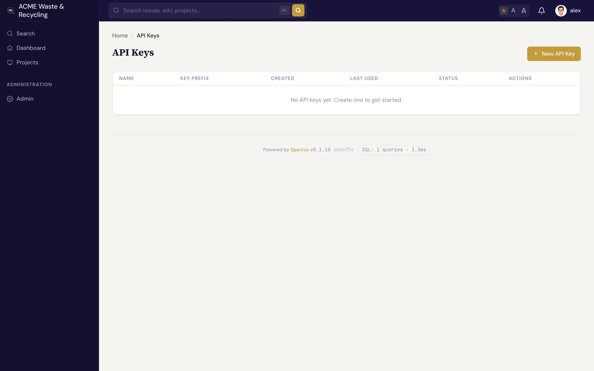

# API keys & scopes

An AI client connects to Specivo with an **API key** — a secret string that authenticates it as a
specific user. Keys are how you give an agent access without sharing a password, and how you take
that access away again.

## Create a key

1. Open **Your profile → API keys** (`/my/api-keys/`).
2. Click to create a new key, give it a clear name (for example, `claude-code` or `ci-agent`), and
   select the **`mcp`** scope.
3. Copy the key when it's shown. It looks like `spv_your_api_key_here` — a string that always
   starts with `spv_`.

!!! warning "Copy the key now"
    The full key value is shown only once, at creation. Specivo stores it hashed and cannot display
    it again. If you lose it, revoke the key and create a new one.

## The `mcp` scope

Scopes limit what a key can be used for. To connect an AI client over MCP, the key needs the
**`mcp`** scope. A key without it will authenticate but be refused by the MCP server.

A key never grants *more* than its owner already has. The agent acts as the user the key belongs to,
so it inherits exactly that user's project roles and permissions — no project membership, no access.

## Use a dedicated service account

Issuing an agent a key from your own personal account works, but it mixes the agent's actions in
with yours and ties its access to your login. The cleaner pattern is a **dedicated service account**:

1. Create a separate user (for example, `agent` or `claude`) for the automation.
2. Add that user to the relevant projects with the **Agent** role, which is built for API and
   automation accounts.
3. Generate the `mcp`-scoped key from that account and hand it to the client.

This keeps the agent's audit trail and permissions distinct from any person's, and lets you adjust
or revoke its access without touching real users' accounts.

!!! tip "Match the role to the job"
    The agent can only do what its account's role allows. Give the service account a read-only role
    on projects where the agent should look but not touch, and a write-capable role only where you
    want it to make changes. See [What agents can do](capabilities.md).

## Rotate and revoke keys

Treat API keys like passwords: rotate them periodically, and revoke any key you no longer use or
suspect is exposed. To rotate, create a new key, update the client's configuration to use it (see
[Connecting an AI client](connecting.md)), then revoke the old one.

!!! warning "Revoking takes effect immediately"
    Revoking a key cuts the agent off at once — its next request fails. If a connected agent is in
    the middle of work, it stops being able to read or write as soon as you revoke. Have the
    replacement key in place before revoking the old one to avoid an interruption.
