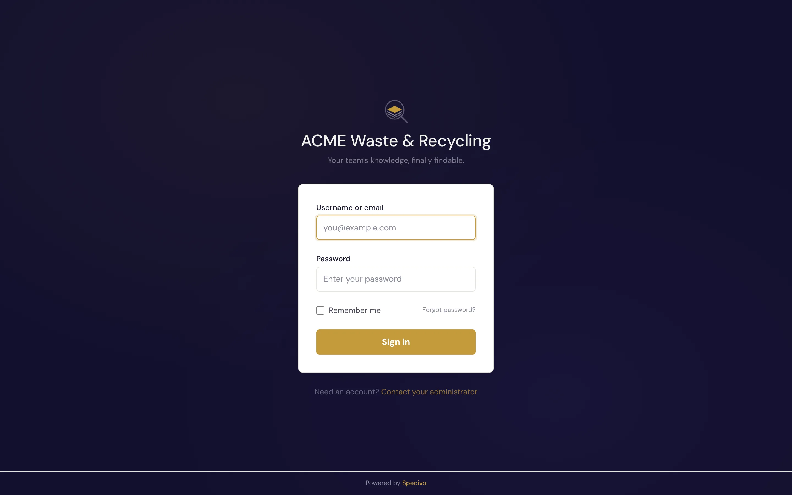
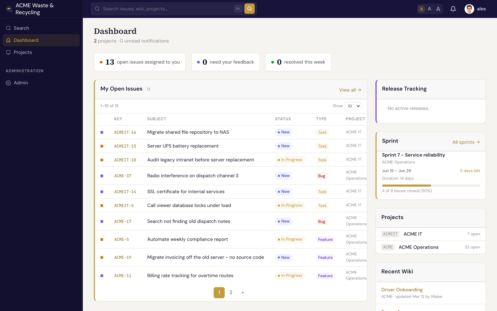

# Your first 10 minutes

This page walks you through the everyday happy path. It assumes someone has already
[installed Specivo](../install/index.md) and given you a sign-in.

## 1. Sign in

Open your team's Specivo URL and sign in with the username (or email) and password you were given.

After signing in you land on your **dashboard** — a personal overview of issues assigned to you and recent
activity across your projects.

## 2. Open your project

Use the **Projects** item in the left sidebar to open the project you work in. The
project **overview** shows its issues, wiki, roadmap, and members. See [Projects](../projects/index.md).

## 3. Find an issue

Open the **Issues** list for your project. Every issue shows its key (like `ACME-42`), subject, tracker,
status, priority, and assignee. Click any row to open the issue.

On the issue page you can read the description, see its [relations](../issues/relations.md) to other
issues, scroll the comment history, and view [attachments](../issues/attachments.md) and
[metadata](../metadata/index.md).

## 4. Leave a comment

On an issue, scroll to the comment box, write an update in Markdown, and post it. Mention a teammate with
`@username` to notify them. Your comment joins the issue's permanent history. See
[Comments & reactions](../issues/comments.md).

## 5. Change the status

When you start work, set the issue's status to **In Progress**; when you finish, set it to **Resolved**.
You can also nudge the **% done** and reassign the issue. See
[Updating & editing issues](../issues/updating.md).

## 6. Create an issue

Spotted something that needs doing? Click **New issue**, pick a tracker (Bug, Feature, Task, or Support),
write a clear subject, and save. That's the whole minimum. See [Creating an issue](../issues/creating.md).

## 7. Search

Press <kbd>⌘K</kbd> (<kbd>Ctrl+K</kbd> on Windows/Linux) anywhere and type. Specivo searches issues, wiki pages, comments, and attachment
descriptions together, by keyword *and* meaning. See [Finding issues](../issues/finding.md).

---

!!! tip "What next?"
    - Skim [Core concepts](core-concepts.md) so the vocabulary clicks.
    - Learn the [interface layout](navigating.md).
    - When you're ready for AI assistance, set up the [MCP server](../ai-agents/index.md).
