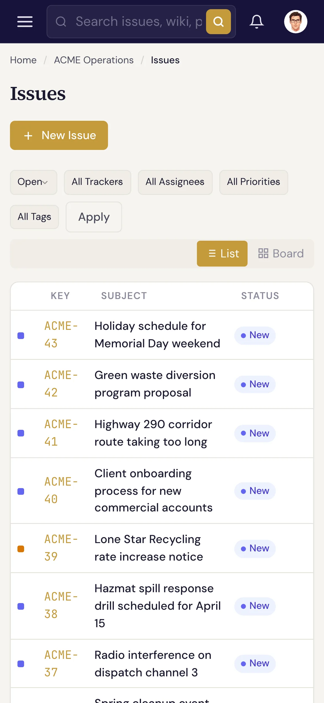

# Navigating the interface

Specivo has two consistent navigation areas on every page: a **sidebar** down the left for getting around,
and a **header** across the top for search and your account.

## The sidebar (left)

The sidebar is how you move around. From top to bottom:

- **Search**, **Dashboard**, **Projects** — always available.
- **Your current project** — once you're in a project, its section lists **Issues**, **Backlog**,
  **Current Sprint**, **Wiki**, **Roadmap**, **Time Tracking**, **Sprints**, and **Settings**.
- **Administration** — an **Admin** link, shown only to administrators.

The **Issues** item shows a badge with the project's open-issue count. To switch projects, click
**Projects** and pick another, or use the project list in the sidebar.

## The header (top)

Running across the top of the main area:

- **Search box** — search issues, wiki, and projects. Press <kbd>⌘K</kbd> (<kbd>Ctrl+K</kbd> on
  Windows/Linux) from anywhere to jump straight into it. See [Finding issues](../issues/finding.md).
- **Font size toggle** — switch between three text sizes for comfortable reading.
- **Notifications** — a bell with an unread badge; open it for recent mentions and updates, or
  **View all notifications**.
- **Your account menu** — your avatar and name open a menu with **Profile**, **Preferences**,
  **API Keys** (for the [MCP server](../ai-agents/api-keys.md) and REST API), and **Sign out**.

!!! tip "Running timer"
    If you start a time-tracking timer on an issue, a live timer appears in the header so you can stop and
    log it from anywhere. See [Time tracking](../projects/time-tracking.md).

## On a phone or tablet

Specivo is responsive. On narrow screens the sidebar collapses behind the **menu button** (☰) in the
header — tap it to slide the sidebar out. Every page and action is still available, just stacked for a
smaller screen.

