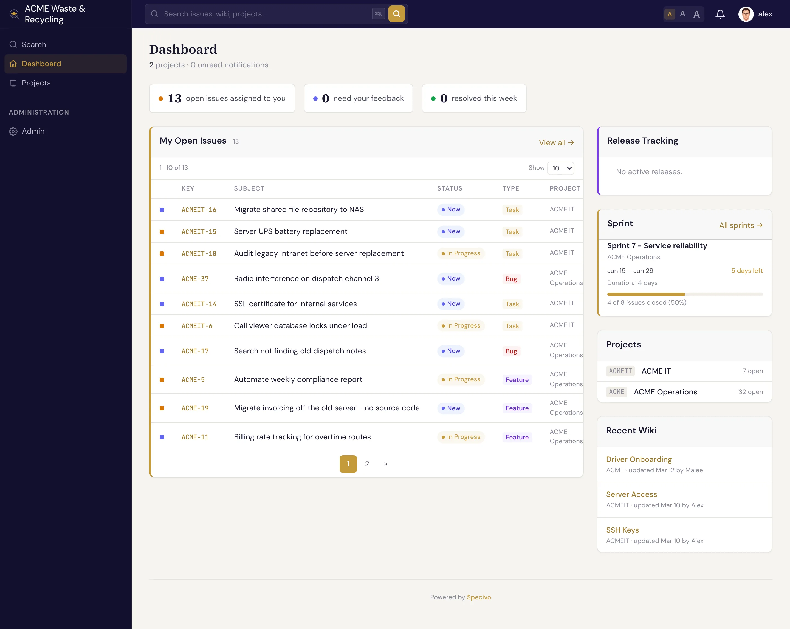

# Specivo user guide

**Specivo** is a self-hosted platform that keeps your team's work and knowledge in one place: a
project tracker, a wiki, and an integration layer that lets AI agents work *inside* the tracker
instead of around it. You run it on your own server, you own the data, and there is no per-seat pricing.

This guide is for the people who use Specivo every day — creating and tracking issues, writing wiki
pages, and connecting AI assistants. If you want to install and operate Specivo, jump to
[Installing Specivo](install/index.md).

## Three things Specivo does

- **Track work.** Issues with types, statuses, priorities, assignees, subtasks, and
  [relations](issues/relations.md) between them. Group work into
  [projects, versions, and sprints](projects/index.md).
- **Keep knowledge.** A per-project [wiki](wiki/index.md) with Markdown, full version history, and
  one-click revert. Cross-link pages and issues so decisions never get lost.
- **Work with AI agents.** A built-in [MCP server](ai-agents/index.md) lets AI assistants read and
  update issues, wiki pages, and search — safely, with every action recorded in an audit log.

## New here?

If this is your first time in Specivo, start with **[Your first 10 minutes](getting-started/first-10-minutes.md)** —
it walks you through signing in, finding your project, opening an issue, and leaving a comment. Then read
**[Core concepts](getting-started/core-concepts.md)** to learn the handful of words (issue, tracker, version,
sprint, wiki) that the rest of this guide uses.

## Find your way around

| If you want to… | Read |
|---|---|
| Understand what an issue is and create one | [Issues](issues/index.md) → [Creating an issue](issues/creating.md) |
| Link issues that block, duplicate, or relate to each other | [Relations](issues/relations.md) |
| Add structured fields like story points or git branches | [Issue metadata](metadata/index.md) |
| Plan releases and sprints | [Versions & roadmap](projects/versions.md), [Sprints](projects/sprints.md) |
| Write and organize documentation | [Wiki & knowledge base](wiki/index.md) |
| Connect Claude Code, Codex, or another AI client | [AI agents & MCP](ai-agents/index.md) |
| Install or self-host Specivo | [Installing Specivo](install/index.md) |

!!! tip "Search is built in"
    Press <kbd>⌘K</kbd> (<kbd>Ctrl+K</kbd>) anywhere in Specivo to search. It uses **hybrid search** — exact keywords *and*
    meaning — so it finds work even when you wrote "login flow" once and "auth sequence" later. See
    [Finding issues](issues/finding.md).
