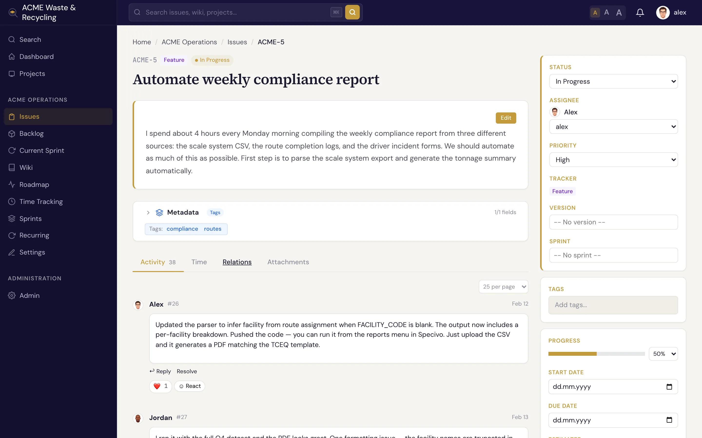

# Comments & reactions

Comments are how the conversation around an issue happens. Each comment is a permanent journal entry on
the issue, so the discussion stays with the work it's about.

## Write a comment

Scroll to the comment box on an issue, write your update, and post it. Comments are
[Markdown](../reference/markdown.md), so you can use lists, tables, links, and fenced code blocks with
syntax highlighting.

## Mention teammates

Type `@username` to mention someone. Mentioning a person **notifies** them, which is the easiest way to
pull a teammate into the discussion or hand something off without reassigning the whole issue.

## Reply in threads

Reply to a specific comment to keep a side discussion together as a **thread**, instead of one long
flat list. This keeps related back-and-forth readable even on busy issues.

## React with emoji

Add an **emoji reaction** to a comment — a quick thumbs-up or eyes — when you want to acknowledge
something without adding another comment to the thread.

!!! note "Comments are permanent"
    Comments are part of the issue's permanent history. They're meant as a record of the discussion, so
    treat them as you would a logbook entry. Changes to the issue's fields are recorded separately in
    its [history](updating.md).
