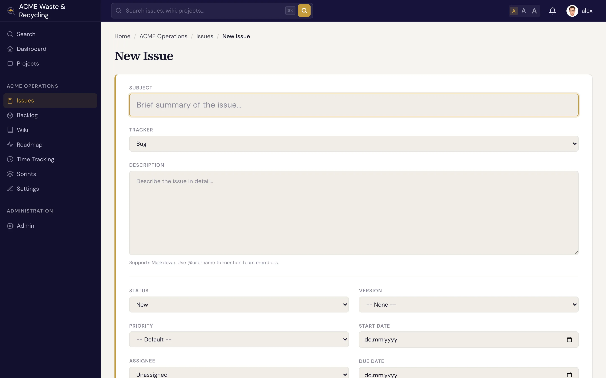

# Creating an issue

Creating an issue takes seconds. The only things Specivo insists on are a **subject** and a
**tracker** — everything else is optional and easy to add later.

## Steps

1. Open the project you're working in, then click **New issue**.
2. **Choose a tracker** — Bug, Feature, Task, or Support. This sets the issue's type.
3. **Write a clear subject.** Keep it short and specific: "Login button does nothing on mobile" beats
   "login broken". The subject can be up to 1024 characters, but shorter is better.
4. **Describe the work** in the description box. It's [Markdown](../reference/markdown.md), so you can
   use headings, lists, tables, and fenced code blocks. Mention a teammate with `@username` to pull
   them in.
5. **Set the optional fields** that apply — assignee, priority, target version, sprint, start and due
   dates, and an estimate. You can skip any of these and fill them in once the issue exists.
6. Click **Create** (or **Save**).

That's it. The issue gets the next number in the project (for example `ACME-57`) and opens on its own
page.

## Required vs optional

| Required | Optional |
|---|---|
| Subject | Description, assignee, priority, category |
| Tracker | Target version, sprint, start/due dates, estimate, parent, watchers, metadata |

!!! tip "Write a description you'll thank yourself for later"
    A good description says what the problem or goal is, how to reproduce a bug, and what "done"
    looks like. The text is indexed for [search](finding.md), so a clear write-up makes the issue
    easy to find months later.

## After creating

- Add structured fields like story points or a git branch — see [Issue metadata](../metadata/index.md).
- Link it to related work — see [Relations](relations.md).
- Break large work into [subtasks](subtasks.md).
- As work progresses, [update the status and % done](updating.md).
