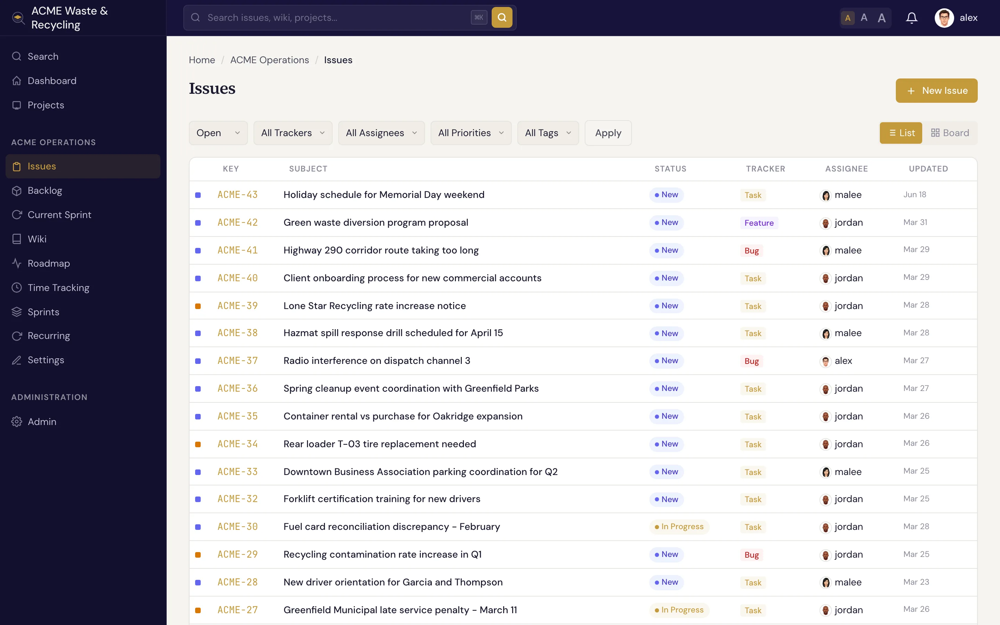

# Finding issues

There are three ways to get to the issue you want: the **list**, the **board**, and **search**. Pick
whichever matches what you're doing.

## The issue list

The **Issues** list shows every issue in the project as rows, with columns for the key (like `ACME-42`),
subject, tracker, status, priority, and assignee. **Filter** the list to narrow it down — by status,
tracker, assignee, version, sprint, and more — and click any row to open the issue.

!!! tip "Filter by metadata"
    If your project defines [metadata](../metadata/index.md), you can filter the list by a metadata
    `key=value` match. For array fields, the filter matches when the array *contains* the value — for
    example, every issue whose `branches` includes `release/1.2`.

## The board

The **board** view lays issues out as cards in columns by status category (backlog, active, done,
closed). It's the quickest way to see *where everything stands* at a glance, and issues move across the
columns as their [status](statuses-workflow.md) changes.

## Search

Press <kbd>⌘K</kbd> (<kbd>Ctrl+K</kbd> on Windows/Linux) anywhere in Specivo to jump to search and start typing.

Specivo uses **hybrid search** — it combines exact **keyword** matching with **semantic** (meaning-based)
matching, so it finds the right work even when the wording differs. Search "auth flow" and it can still
surface an issue you wrote about the "login sequence". It searches across:

- issues (subjects and descriptions)
- wiki pages
- comments
- attachment descriptions

!!! note "Semantic results not showing up?"
    Semantic search relies on an index the operator builds on the server. Until that's in place, keyword
    search still works — you just won't get the meaning-based matches. See
    [Troubleshooting](../reference/troubleshooting.md) if results look thin.
