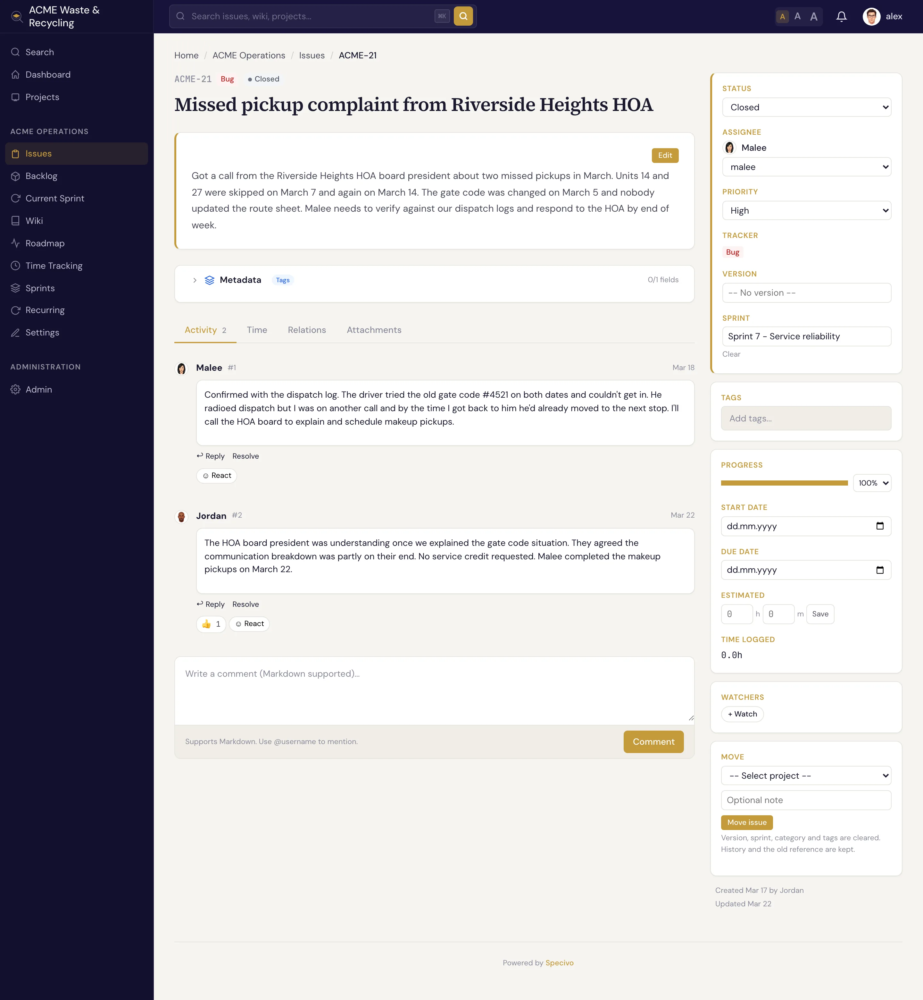

# What is an issue?

An **issue** is the unit of work in Specivo. Every bug to fix, feature to build, task to do, or
question to answer lives as one issue with its own page, its own number, and its own history. Issues
belong to a [project](../projects/index.md) and are numbered per project: the first issue in the
`ACME` project is `ACME-1`, the next is `ACME-2`, and so on. That key never changes, so you can paste
`ACME-42` into a chat or a commit message and everyone knows exactly which issue you mean.

## Trackers — the four issue types

A **tracker** is the *type* of an issue. Specivo ships with four:

| Tracker | Use it for | On the roadmap? |
|---|---|---|
| **Bug** | Something is broken and needs fixing | Yes |
| **Feature** | New capability or enhancement | Yes |
| **Task** | General work that isn't a bug or feature | Yes |
| **Support** | A question or request from a user | No |

Bug, Feature, and Task appear on the [roadmap](../projects/versions.md). Support issues do not, so
day-to-day requests don't clutter your release planning.

## The fields on an issue

Only two fields are required when you create an issue: a **subject** and a **tracker**. Everything
else is optional and can be filled in later.

| Field | What it holds |
|---|---|
| **Subject** | A short, clear title (up to 1024 characters) — required |
| **Description** | The full write-up, in Markdown, with `@username` mentions |
| **Tracker** | Bug, Feature, Task, or Support — required |
| **Status** | Where the issue sits in its lifecycle (New, In Progress, …) |
| **Priority** | Low, Normal, High, Urgent, or Immediate |
| **Assignee** | The person responsible for the work |
| **Category** | A project-scoped label such as "Backend" or "Frontend" |
| **Target version** | The [version](../projects/versions.md) (milestone/release) this is aimed at |
| **Sprint** | The [sprint](../projects/sprints.md) this issue is planned into |
| **Start date / Due date** | When work should begin and finish |
| **Estimate** | Estimated hours, plus original and remaining estimates |
| **% done** | Progress from 0 to 100 |
| **Parent issue** | Makes this a [subtask](subtasks.md) of another issue |
| **Private** | Hides the issue from members who lack permission to see private issues |
| **Watchers** | People notified of changes even if they aren't the assignee |
| **Metadata** | Structured, typed fields beyond the core set — see below |

**Metadata** is extra typed data (story points, a git branch, a severity level) defined by reusable
schemas, so the same fields stay consistent across issues. See [Issue metadata](../metadata/index.md).

## What you can do with an issue

- [Create one](creating.md) — pick a tracker, write a subject, set a few fields, save.
- [Update and edit it](updating.md) — change status, reassign, set % done; every change is recorded.
- [Link it to other issues](relations.md) — mark what blocks, duplicates, or relates to it.
- [Break it into subtasks](subtasks.md) — build a parent/child hierarchy.
- [Comment on it](comments.md) — discuss in Markdown, mention teammates, react with emoji.
- [Attach files](attachments.md) — screenshots, logs, documents.
- [Find it again](finding.md) — through the list, the board, or search.
