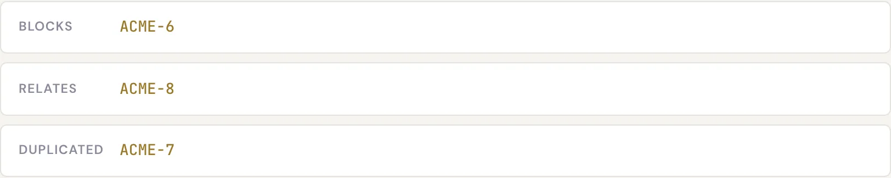

# Relations between issues

A **relation** is a typed link between two issues. Relations capture how work fits together: what
blocks what, which issue duplicates another, what order things should happen in. They're informational
links and dependency markers — they don't move issues through statuses on their own.

## The relation types

Specivo has five canonical relations. Four of them are *directional*, so each one also has a reverse
that shows up on the other issue automatically — nine named links in all.

| Relation | Reverse | What it means | When to use it |
|---|---|---|---|
| **relates to** | relates to | A plain, symmetric link between two issues | They're connected and worth reading together, with no dependency |
| **duplicates** | **duplicated by** | This issue describes the same thing as another | You found a second report of the same bug or request |
| **blocks** | **blocked by** | A blocked issue can't proceed until its blocker is done | One piece of work must finish before another can start |
| **precedes** | **follows** | A scheduling order: one should happen before the other | You want a sequence; **precedes** can carry an optional delay in days |
| **copied to** | **copied from** | Records that one issue was copied or derived from another | You split or cloned an issue and want to keep the trail |

**relates** is symmetric — it reads the same from either side. The other four are directional: if
`ACME-10` **blocks** `ACME-11`, then `ACME-11` shows **blocked by** `ACME-10`.

!!! note "Precedes can carry a delay"
    When you add a **precedes** relation you can set an optional **delay in days** — useful when the
    follow-up work shouldn't start immediately after the first issue finishes.

!!! warning "No circular dependencies"
    Specivo prevents circular **blocks** and **precedes** chains. If `A` blocks `B` and `B` blocks `C`,
    you can't then make `C` block `A` — the loop would be impossible to satisfy, so Specivo refuses it.

## Add a relation

1. Open the issue and find the **Relations** section.
2. Choose the relation type (relates, duplicates, blocks, precedes, copied to).
3. Enter the other issue (for example `ACME-11`).
4. For **precedes**, optionally set a delay in days.
5. Save. The reverse relation appears on the other issue automatically.

## Remove a relation

In the **Relations** section, find the link you want to drop and remove it. The matching reverse link
disappears from the other issue at the same time.
