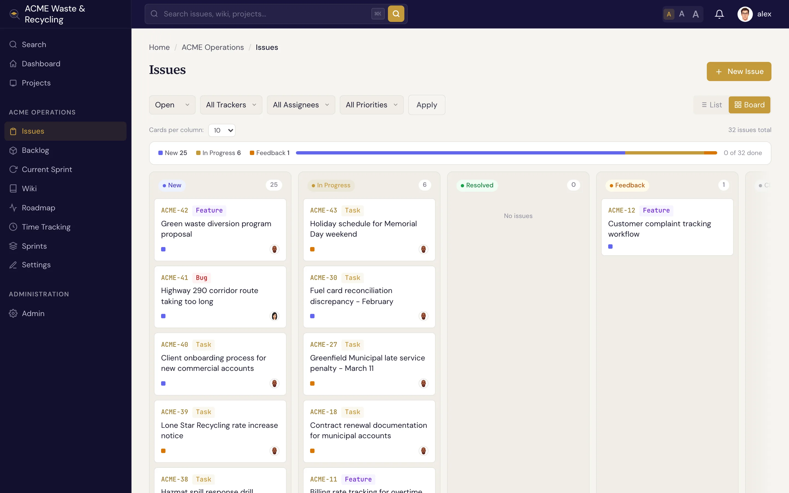

# Statuses & workflow

An issue's **status** says where it sits in its lifecycle. Specivo ships with a set of sensible
defaults, and each status belongs to a **category** that drives the board columns and reports.

## The default statuses

| Status | Category | Meaning |
|---|---|---|
| **New** | backlog | Reported but not started |
| **In Progress** | active | Someone is actively working on it |
| **Resolved** | done | Work is finished (sets **% done** to 100) |
| **Feedback** | active | Waiting on input or review before it can move on |
| **Closed** | closed | Done and verified (sets **% done** to 100) |
| **Rejected** | closed | Won't be done — duplicate, invalid, or out of scope |

The four categories — **backlog**, **active**, **done**, and **closed** — are what reports and boards
group by, so the exact status names matter less than the category they fall into.

## The typical flow

Most issues follow a simple path:

**New → In Progress → Resolved**

You pick up a new issue and set it to **In Progress**, do the work, then set it to **Resolved**. Use
**Feedback** when an issue is parked waiting on someone, **Closed** once it's verified, and **Rejected**
when it won't be done at all.

## How status drives the board

The board view shows columns by status category, so an issue moves across the board as its status
changes: from the backlog column, into the active column when you start, and into done/closed when you
finish. See [Finding issues](finding.md) for the board and list views, and
[Sprints](../projects/sprints.md) for the sprint board.

## Customizing the workflow

!!! note "Admins control transitions"
    The statuses above are the shipped defaults. A project manager can customize the **workflow** —
    which status an issue may move *to* from each status, and which roles are allowed to make each
    transition. So in your project some moves may be restricted, or extra rules may apply, depending on
    your role.
