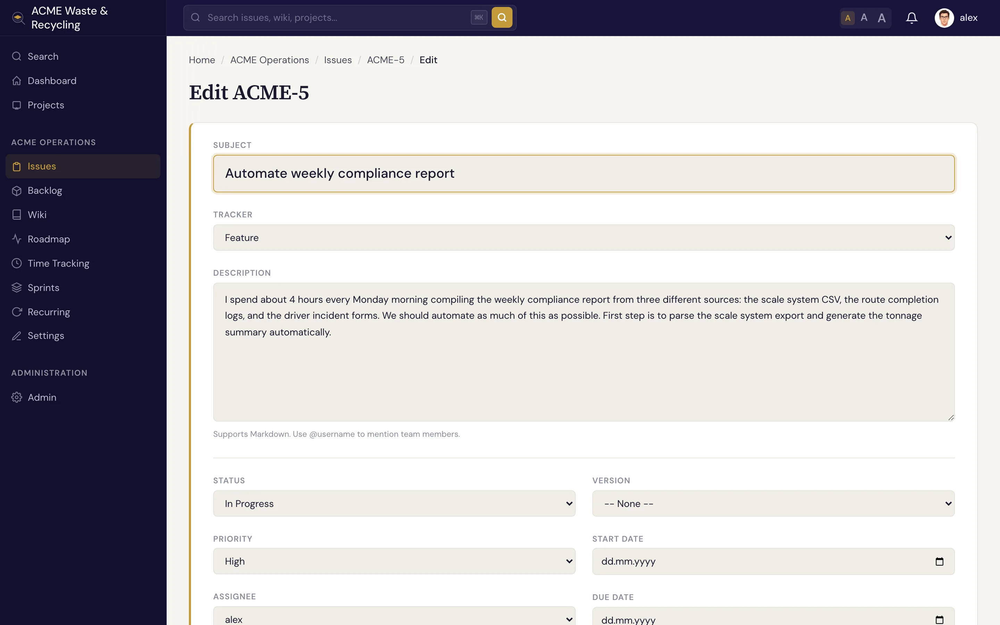

# Updating & editing issues

Issues change as work moves forward. You can edit almost any field on an issue at any time, and
Specivo keeps a record of what changed.

## Change the status

The most common update is moving an issue along its lifecycle. Set the status to **In Progress** when
you start, and to **Resolved** when you finish. Resolving an issue sets **% done** to 100
automatically. See [Statuses & workflow](statuses-workflow.md) for the full set of statuses and how
they drive the board.

## Reassign

Change the **Assignee** to hand the issue to someone else. The new assignee is responsible for it from
then on; add **watchers** if other people still need to follow along.

## Edit the subject and description

Click into the **subject** or **description** to fix wording, add detail, or restructure. The
description is [Markdown](../reference/markdown.md), so formatting, code blocks, and `@username`
mentions all work.

## Set % done and other fields

- Nudge **% done** as work progresses (0–100). It moves to 100 when the issue is resolved or closed.
- Adjust **priority**, **category**, **target version**, **sprint**, **start/due dates**, and the
  **estimate** as plans firm up.
- Fill in any [metadata](../metadata/index.md) fields the project defines.

!!! note "Comments vs field edits"
    To discuss the work or post an update, add a [comment](comments.md). To record progress on the
    work itself, change the fields. Both end up in the issue's history.

## Move an issue to another project

Sometimes an issue lands in the wrong place — a request filed in your inbox project really belongs to
the team that owns it. The issue detail sidebar has a **Move** card: pick a target project, add an
optional note explaining the move, and submit.

The issue keeps its internal identity but takes a **new per-project number** in the target. An issue
that was `INB-1` becomes `HOME-1` once it lands in the `HOME` project. The **old reference still
resolves** — paste `INB-1` anywhere and it redirects to the issue at its new key, so links you shared
earlier don't break.

Moving carries the issue's substance with it. **Preserved:** full history and comments, relations,
attachments, watchers, time entries, and custom [metadata](../metadata/index.md). **Cleared:** the
fixed version, sprint, category, and tags — these belong to the old project and have no meaning in the
new one, so you set them fresh in the target.

!!! note "Only standalone issues can move"
    An issue with a **parent** or its own **subtasks** can't be moved as-is — detach it from the
    hierarchy first, move it, then rebuild the links if you still need them. This keeps a parent and its
    children from being split across projects.

To move an issue you need edit permission in the source project and the right to add issues in the
target. The move is also available to [AI agents](../ai-agents/index.md) over the REST API
(`POST /api/v1/issues/{ref}/move/`) and the `specivo_move_issue` MCP tool — see
[What agents can do](../ai-agents/capabilities.md).

## Everything is recorded

Editing the core fields of an issue — status, assignee, priority, dates, % done, and so on — is logged
in the issue's **history**, with who changed what and when. Nothing is silently overwritten, so you can
always see how an issue got to where it is.
