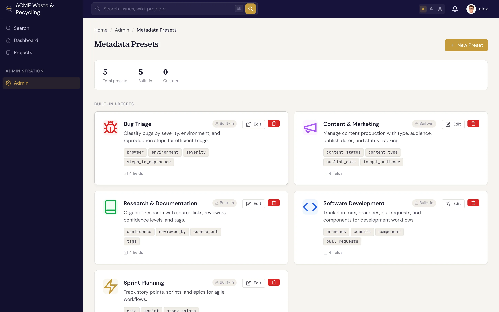

# Metadata schemas

A **metadata schema** defines a group of typed [metadata](index.md) fields and decides which issues they
appear on. Instead of inventing fields one issue at a time, you enable a schema once and every matching issue
gets the same consistent set of fields.

## How a schema attaches

A schema applies in one of two ways:

- **Project level** — the fields appear on every issue in the project, regardless of tracker.
- **Per tracker** — the fields appear only on issues of a chosen tracker, for example only on **Bug** issues.

**Multiple schemas can apply to one issue.** A project-level schema and a tracker-specific schema both attach,
so a single **Bug** issue might show its team's standard fields *and* the bug-specific fields together. Each
schema contributes its own fields; they don't interfere with one another.

## Who manages schemas

Schemas are defined and enabled by **Managers** in **Admin → Metadata presets**
(`/admin/metadata-presets/`). Everyone else simply fills in the fields on their issues — you don't need to
touch the admin area to use metadata.

!!! note "Manager-only area"
    Creating, enabling, or editing schemas requires the **Manager** role. If you don't see
    **Admin → Metadata presets**, ask a project manager to set up the fields you need.

## Project-derived (computed) fields

Most metadata is filled in per issue. A **computed** field is different: its value is a fixed function
of the **project**, so every issue in that project gets the same value automatically, with no manual
step. A typical use is grouping projects under an area — an "Area" or "cabinet" field that says which
part of the org a project belongs to.

A computed field is configured **once per project**, as a `computed_metadata` map in the project's
settings (set through the project update / admin area, which requires the project-manage permission).
After that:

- It is **auto-filled on every issue** in the project, across every creation path — the web UI, the
  REST API, and [AI agents](../ai-agents/index.md) — with nothing for anyone to enter.
- It is **never stored on the issue** and **can't be edited or overridden** by users, so it can never
  drift out of sync with the project.
- It **recomputes automatically** when an issue is [moved to another project](../issues/updating.md#move-an-issue-to-another-project),
  picking up the new project's value with no extra step.

Because the value comes from the project, not the issue, a computed field is the right choice for
anything that should always match the project it lives in.

## Built-in presets

Specivo ships with five ready-made presets. Enable any of them as-is, or use them as a starting point for
your own. Each preset is a schema with the fields below.

### Software Development

Track the code behind an issue.

| Field | Type |
|---|---|
| `component` | String |
| `commits` | Array |
| `branches` | Array |
| `pull_requests` | Array |

### Bug Triage

Capture the details that make a bug reproducible and prioritizable.

| Field | Type |
|---|---|
| `severity` | Enum — `critical`, `major`, `minor`, `trivial` |
| `environment` | Enum — `production`, `staging`, `development`, `local` |
| `browser` | String |
| `steps_to_reproduce` | String |

### Content & Marketing

Plan and track content production.

| Field | Type |
|---|---|
| `content_type` | Enum — `blog`, `social`, `email`, `landing_page`, `video`, `whitepaper`, `case_study` |
| `target_audience` | String |
| `publish_date` | Date |
| `content_status` | Enum — `idea`, `draft`, `in_review`, `approved`, `published` |

### Sprint Planning

Add agile estimation fields to issues.

| Field | Type |
|---|---|
| `story_points` | Integer (1–100) |
| `sprint` | String |
| `epic` | String |

### Research & Documentation

Record sources and review state for research work.

| Field | Type |
|---|---|
| `source_url` | URL |
| `reviewed_by` | String |
| `confidence` | Enum — `high`, `medium`, `low` |
| `tags` | Array |

## Next steps

- [What is metadata?](index.md) — the concept and the field types.
- [Working with metadata values](values.md) — fill in fields, edit arrays, and filter issue lists.
