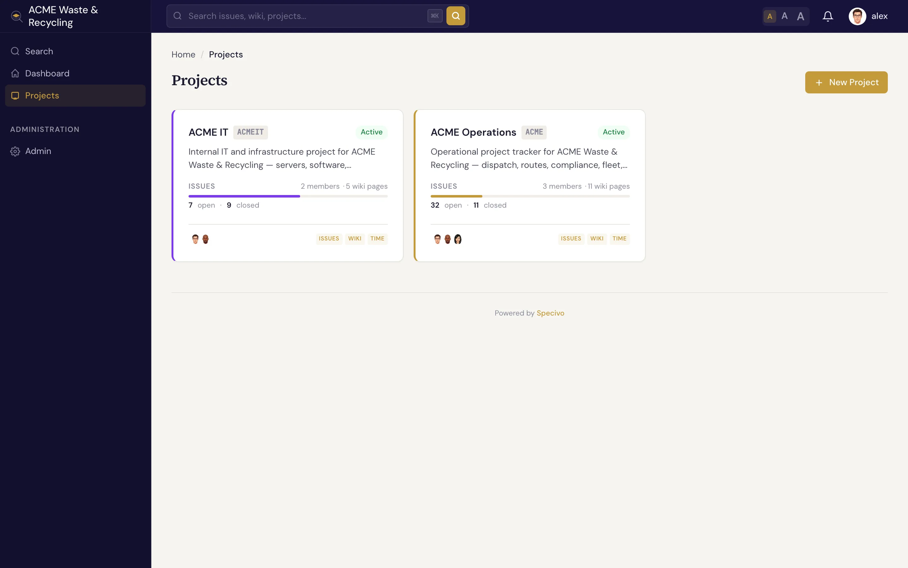
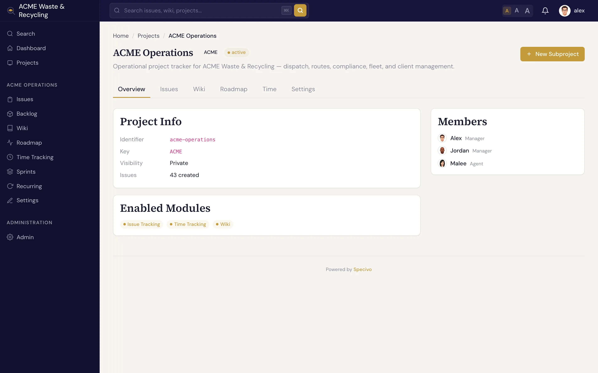

# Projects

A **project** is the container that holds a body of work: its issues, its [wiki](../wiki/index.md),
its [versions](versions.md), its [sprints](sprints.md), and a member list with roles. Every issue,
wiki page, and time entry belongs to exactly one project. Most of what you do in Specivo happens
inside one.

## What defines a project

| Field | What it holds |
|---|---|
| **Name** | The human-readable title, shown in lists and headers |
| **Key** | A short **uppercase** prefix like `ACME` that brands every issue (`ACME-1`, `ACME-42`). It never changes. |
| **Identifier** | The URL slug used in links, e.g. `/projects/acme/` |
| **Parent** | An optional parent project, so you can nest related projects under one umbrella |
| **Visibility** | **Public** (anyone who can reach the site can read it) or **private** (members only) |
| **Color** | A color used to tint the project in lists and badges so it's easy to spot |

The **key** is the part you'll type and paste most. Once people learn that `ACME-42` is an issue in
the ACME project, that reference works everywhere — in chat, in commit messages, and in
[search](../issues/finding.md).

## Member roles

People join a project with a **role** that decides what they can do. Specivo ships with four:

| Role | For | Can do |
|---|---|---|
| **Manager** | Project leads | Full control — settings, members, versions, sprints, workflow, and all issue and wiki actions |
| **Developer** | People doing the work | Create and update issues, log time, edit wiki pages, comment |
| **Reporter** | Stakeholders and requesters | File and comment on issues, follow progress |
| **Agent** | Automation and API/[MCP](../ai-agents/index.md) accounts | A role scoped for service accounts that act through the API |

The **Agent** role exists for AI assistants and automation. Teams usually create a dedicated service
account, give it the Agent role on the projects it should touch, and issue it an API key. See
[AI agents & MCP](../ai-agents/index.md).

!!! note "Roles are per project"
    A person can be a Manager in one project and a Reporter in another. Membership and role are set on
    each project, not globally.

## Project status

A project is in one of three states:

- **Active** — the normal state; the project is open for work.
- **Closed** — work has wound down. The project stays fully readable, but it's marked as no longer
  active so it drops out of the day-to-day view.
- **Archived** — kept for the record. The project is preserved but tucked away.

## The project overview

The **overview** is the project's home page. It pulls together the project's name, description, and
quick links to its issues, [roadmap](versions.md), [sprints](sprints.md), [wiki](../wiki/index.md),
and time, so you can see the shape of the project at a glance and jump to the area you need.

From here you typically branch out to:

- [Versions & roadmap](versions.md) — group issues toward releases and watch progress.
- [Sprints](sprints.md) — plan and run time-boxed iterations.
- [Time tracking](time-tracking.md) — log hours and read reports.
