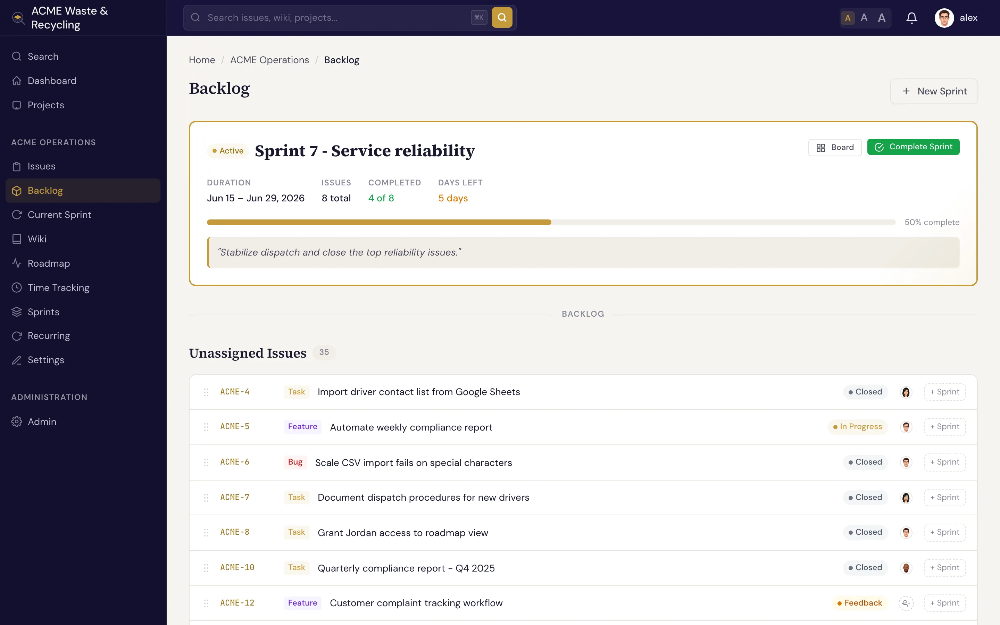
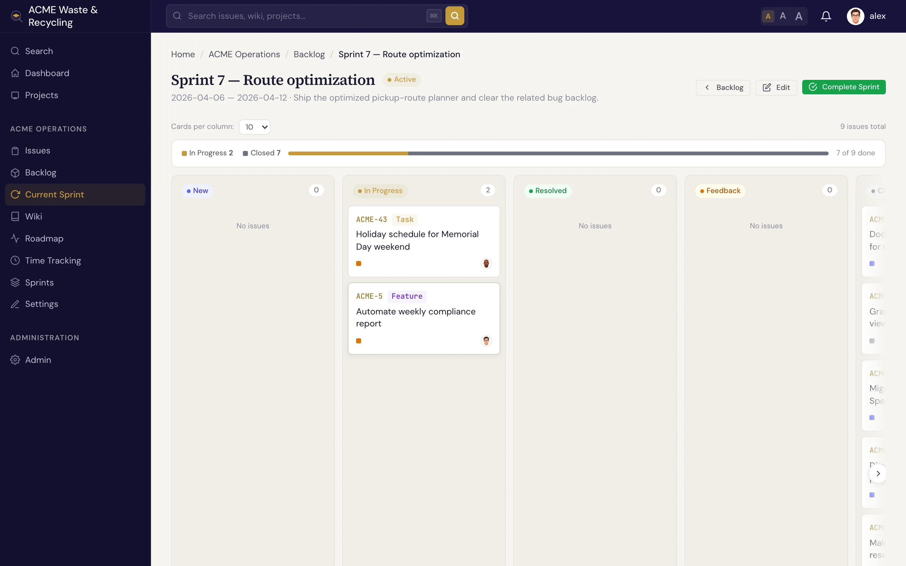

# Sprints

A **sprint** is a time-boxed iteration: a fixed window in which the team commits to a set of issues
and a goal. Where [versions](versions.md) plan toward a release, sprints plan the next week or two of
work. You **plan** a sprint, **start** it, and **complete** it.

## What a sprint holds

| Field | What it holds |
|---|---|
| **Name** | The sprint label, e.g. "Sprint 14" |
| **Goal** | A one-line statement of what the sprint aims to achieve |
| **Status** | **Planned**, **active**, or **completed** |
| **Start date / End date** | The window the sprint runs for |

!!! note "One active sprint per project"
    A project can have only **one active sprint** at a time. Plan as many sprints ahead as you like,
    but you start them one after another.

## The sprint lifecycle

1. **Plan.** Create the sprint, set its goal and dates, and pull issues into it from the backlog
   while its status is **planned**.
2. **Start.** When the window opens, **start** the sprint. It becomes the project's one **active**
   sprint, and its issues show up on the sprint board.
3. **Complete.** At the end of the window, **complete** the sprint. Completing it **snapshots the
   team's velocity** — a record of how much work was finished — so you have a baseline for planning
   the next one.

## The backlog

The **backlog** is the pool of issues that aren't yet committed to a sprint. This is where you plan:
review what's waiting, decide what fits the next iteration, and assign issues to a sprint. An issue's
**sprint** field is the link — set it (from the backlog or the issue itself) to pull the issue in.

## The sprint board

The **sprint board** shows the active sprint's issues as cards in columns by status — New, In
Progress, Resolved, and so on — so the team can see the state of the iteration and move work along.
The columns follow the status categories (backlog, active, done), the same ones that drive the
[issue board](../issues/index.md).

Use the board during the sprint for the day-to-day flow, and the [roadmap](versions.md) when you need
the longer view across releases.
