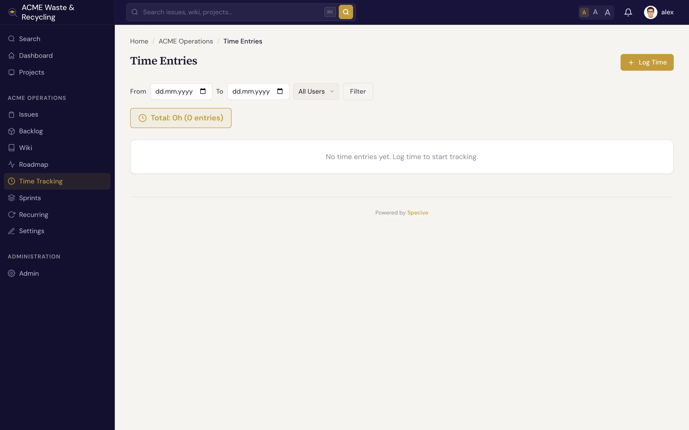

# Time tracking

Specivo lets you **log time** against the work you do — hours spent on an issue or a project, tagged
with the kind of activity. Logged time rolls up into reports so you can see where effort goes and
compare it against your estimates.

## Log time against an issue

Open the issue and add a time entry: the number of **hours**, the **date**, an **activity**, and an
optional comment. Logging against an issue is the common case, because it ties the effort to a
specific piece of work. You can also log time at the project level for work that doesn't map to one
issue.

### Activities

Every entry is tagged with an **activity** so reports can break effort down by type:

| Activity | For |
|---|---|
| **Development** | Writing and changing code — the default |
| **Design** | UI, UX, and design work |
| **Testing** | QA, test writing, verification |
| **Meetings** | Planning, standups, reviews |
| **Support** | Helping users, answering requests |

**Development** is selected by default, so the common case is one click less.

## Estimate versus spent

Issues carry an **estimate** — estimated hours, with original and remaining estimates — alongside the
time actually **logged**. Comparing the two tells you whether a piece of work is on track: an issue
estimated at 8 hours with 12 logged and still open is a signal worth a look. See the full field set
in [What is an issue?](../issues/index.md).

## The project Time area

Each project has a **Time** area that lists time entries and rolls them into reports — totals by
activity, by person, and over a date range — so a [Manager](index.md) can see how effort is spread
across the project.

