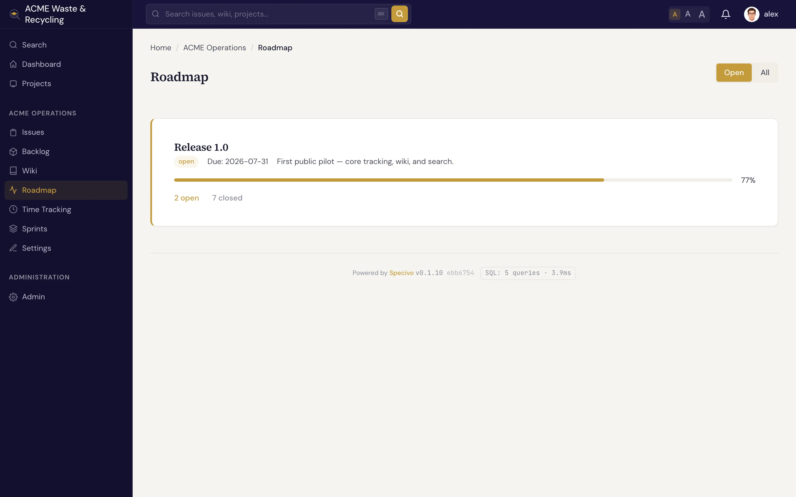

# Versions & roadmap

A **version** is a milestone or release: a named target that issues are grouped toward, such as
`v1.2` or "Q3 launch". Versions are how you plan ahead — you assign issues to a version, then watch
the **roadmap** fill in as the work gets done.

## What a version holds

| Field | What it holds |
|---|---|
| **Name** | The release or milestone name, e.g. `v1.2` |
| **Description** | A short summary of what the version is for |
| **Status** | **Open** (accepting work), **locked** (no new issues, work in progress finishes), or **closed** (shipped/done) |
| **Target date** | The effective date you're aiming to deliver by |
| **Sharing** | The scope the version is shared with (for example, sub-projects) |
| **Wiki page** | An optional linked [wiki page](../wiki/index.md) — handy for release notes |

The optional **wiki page** link is a good place to keep release notes: write the page once, link it
from the version, and everyone reaching the roadmap can find the notes.

## Assign an issue to a version

Open the issue and set its **target version** field to the version you want. That's the single link
between an issue and a release — once set, the issue counts toward that version's progress and shows
up under it on the roadmap. See [Updating an issue](../issues/updating.md).

Only the three roadmap trackers — **Bug**, **Feature**, and **Task** — appear on the roadmap.
**Support** issues don't, so everyday requests don't crowd your release planning.

## The roadmap

The **Roadmap** lists the project's versions and shows progress for each: how many of its issues are
done versus still open. It's the at-a-glance answer to "what's left before we ship?".

Click a version to see the issues assigned to it, grouped by status, so you can drill from the
high-level plan straight into the work.

## Creating and managing versions

Versions are created and edited by a project **Manager** in the project's settings. Set the name and
target date, leave the status **open** while you're still adding issues, move it to **locked** as you
near the finish, and **close** it once the release ships.

!!! warning "You can't delete a version that's still in use"
    Deleting a version **fails while issues still reference it**. Specivo won't orphan those issues.
    First reassign or clear the **target version** on every issue pointing at it, then delete the
    version.
