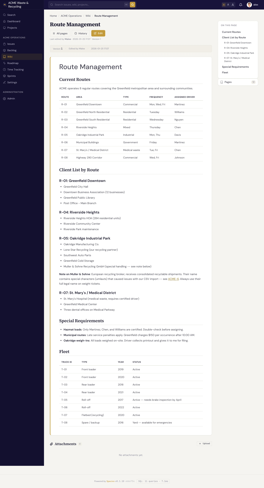
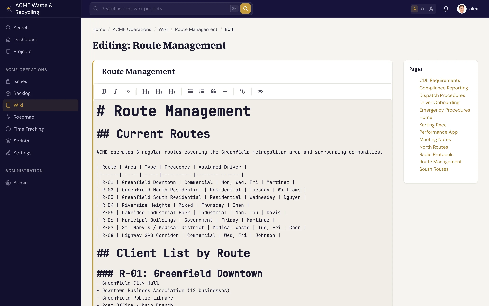

# Creating & editing pages

Writing in the wiki is the same loop every time: give a page a title, write Markdown, save. Each save
becomes a new version you can look back on or roll back to, so there's no risk in editing freely.

## Create a page

1. Open the project's **Wiki** tab.
2. Click **New page**.
3. Type a **title** using spaces — for example `Release Process`. Specivo derives the URL slug for you.
4. Write the **body** in Markdown.
5. (Optional) Choose a **parent page** to nest it, and add an edit comment.
6. **Save**.

That's the whole minimum — a title and some content.

!!! tip "Titles use spaces"
    Type `Release Process`, not `Release_Process`. The slug (`release-process`) is generated
    automatically, and slugs are normalized so links resolve regardless of casing or separators. See
    [Wiki overview](index.md#slugs-are-normalized).

## Edit a page

Open any editable page and click **Edit**. You get the Markdown source in an editor; change what you
need and **Save**.

!!! note "Protected pages are read-only"
    If a page is marked **protected**, the **Edit** action is unavailable until its protected state is
    changed. See [Protected pages](index.md#protected-pages).

## Every save is a new version

When you save, Specivo records a **new version** of the page along with **who** saved it and an
**optional edit comment**. The comment is a short note about what changed ("fixed the staging URL",
"added rollback steps") — it's worth writing one, because it's what makes the history readable later.

Nothing is overwritten in place: previous versions stay available, and you can compare or revert to
them. See [History & linking](history-linking.md).

## Edit a single section

You don't have to open the whole page to change one part of it. Each heading in a page can be edited on
its own — useful for long pages where you only want to touch one section and leave the rest untouched.
Section edits save as a new version just like a full-page edit does.

## Attach files

Wiki pages support **attachments** — diagrams, screenshots, PDFs, exported data. Add a file to a page
and it keeps its original filename, size, and type, plus an optional **description**. Those descriptions
are **searchable**, so a well-described attachment turns up in search later.

The maximum upload size is set by whoever runs your Specivo server; there's no built-in restriction on
file type. Attachments also work on issues and comments — see [Attachments](../issues/attachments.md).

## What's next

- [History & linking](history-linking.md) — view past versions, revert, restore from trash, and
  cross-link with `[[Page Name]]`.
- [Markdown reference](../reference/markdown.md) — the full set of formatting you can use.
