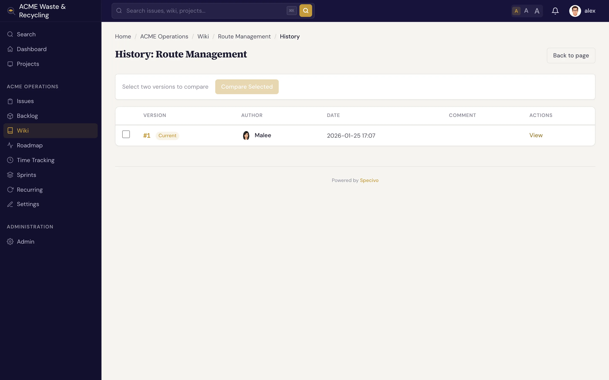

# History & linking

The wiki keeps a complete record of how every page changed, and it ties pages to each other — and to
your issues — so knowledge stays connected instead of scattered.

## Version history

Every time a page is saved, Specivo stores a **version** with its author and the optional edit comment.
Open a page's **History** to see the full list of versions in order.



From the history you can:

- **View a past version** to read the page as it was at that point.
- **Compare** versions to see what changed between two saves.
- **Revert** to an earlier version with one click. Reverting doesn't erase anything — it creates a
  *new* version whose content matches the old one, so the revert itself is recorded in the history too.

This is why edit comments matter: a list of dated, commented versions tells the story of a page at a
glance. See [Creating & editing pages](editing.md#every-save-is-a-new-version).

## Delete and restore

Deleting a wiki page is a **soft delete** — the page moves to a **trash** rather than being destroyed.
From the trash you can **restore** a page, bringing it back with its history intact.

!!! warning "Deleting moves a page to trash, not oblivion"
    A deleted page disappears from the wiki and from normal navigation, and any `[[links]]` pointing to
    it will no longer resolve until it's restored. Restore it from the trash if you removed it by
    mistake. Treat deletion as "hide and archive," not as a guaranteed permanent wipe — but still
    delete deliberately, since readers and links lose the page in the meantime.

## Cross-link pages

Link one wiki page to another with double brackets:

```text
See the [[Release Process]] page before you deploy.
```

`[[Page Name]]` renders as a link to that page. Because slugs are
[normalized](index.md#slugs-are-normalized), the link resolves whether you write `[[Release Process]]`,
`[[release-process]]`, or `[[Release_Process]]` — they all point to the same page. You can link by the
page's title or by its slug.

!!! tip "Build a web, not a pile"
    Cross-linking is what turns a folder of pages into a knowledge base. Link from an overview page down
    to its details, and from detail pages back up — readers (and AI agents) follow the trail instead of
    hunting.

## How wiki and issues connect

Wiki pages and issues live in the same project and surface together in **search**. Press <kbd>⌘K</kbd> (<kbd>Ctrl+K</kbd>)
anywhere and Specivo searches issues, wiki pages, comments, and attachment descriptions at once — by
keyword *and* by meaning. A decision you wrote on a wiki page turns up next to the issue that prompted
it. See [Finding issues](../issues/finding.md).

To tie a specific issue and page together, link to the issue from the wiki page (paste its URL) and
reference the page from the issue's description or a comment. The two halves of a piece of work — the
*what* in the issue and the *why* in the wiki — stay one click apart.

## What's next

- [Wiki overview](index.md) — pages, slugs, nesting, and protected pages.
- [Creating & editing pages](editing.md) — write, edit, and attach files.
