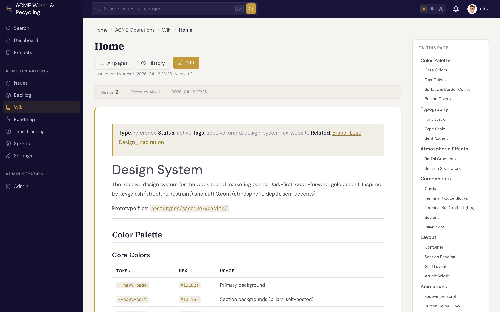

# Wiki overview

Every project in Specivo has its own **wiki** — a knowledge base where you keep the things that
don't belong in an issue: design notes, runbooks, onboarding docs, meeting decisions, conventions.
Pages are written in Markdown, they link to each other, and they keep a full edit history so nothing
is ever lost.

There is **one wiki per project**. Open it from the project's **Wiki** tab.

## What a wiki page is

A wiki page has a **title** and a Markdown **body**. The title is what readers see as the heading and
in links; from it Specivo derives a URL **slug** automatically. You write the title — Specivo handles
the slug.

| Part | What it is |
|---|---|
| Title | The human-readable name, shown as the page heading |
| Slug | The URL-safe identifier, derived from the title |
| Body | Markdown content — headings, lists, tables, code, images, links |

Pages support the same Markdown as issue descriptions and comments, plus wiki-only cross-links with
`[[Page Name]]`. See [History & linking](history-linking.md) for cross-links, and the
[Markdown reference](../reference/markdown.md) for everything you can write.

## Slugs are normalized

You don't have to remember exactly how a page name was capitalized or spaced. Slugs are **normalized**,
so all of these resolve to the same page:

- `My Page`
- `my-page`
- `My_Page`

That means a link, a search result, and a hand-typed URL all land in the right place even if the casing
or separators differ.

A title with no Latin letters or digits — a Thai-only title such as `คู่มือเริ่มต้น`, say — still gets
a usable, unique address (`page-<id>`) rather than an empty slug, so non-Latin pages link and resolve
just like any other.

!!! tip "Use spaces in titles, not underscores"
    When you create a page, type the title with **spaces** — `Release Process`, not `Release_Process`.
    Specivo turns that into a clean slug (`release-process`) on its own. Underscores in the title just
    make the heading look awkward.

## Nested pages

A page can have a **parent**, so you can build a hierarchy instead of one flat list — for example a
top-level `Onboarding` page with `Onboarding / Dev Setup` and `Onboarding / Accounts` beneath it.
Nesting is organizational; it keeps related pages grouped and easier to browse.

## Protected pages

A page can be marked **protected**, which makes it **read-only**. Use this for content that should be
stable and not edited casually — published policies, finalized specs, or reference material. Readers can
still open and link to a protected page; only its protected state controls whether it can be edited.

## What's next

- [Creating & editing pages](editing.md) — write a page, edit it, attach files, and edit by section.
- [History & linking](history-linking.md) — version history, revert, trash, and `[[cross-links]]`.
