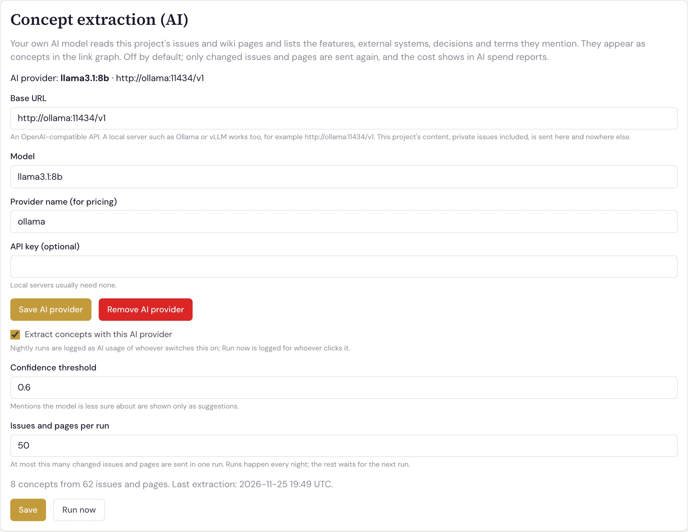
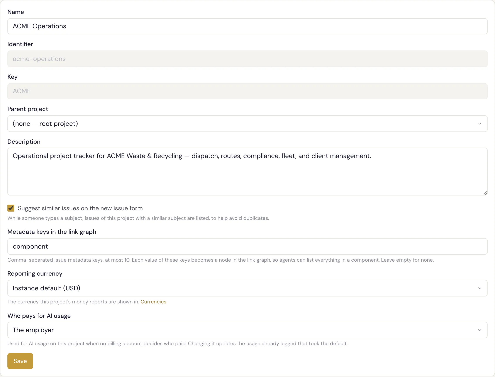
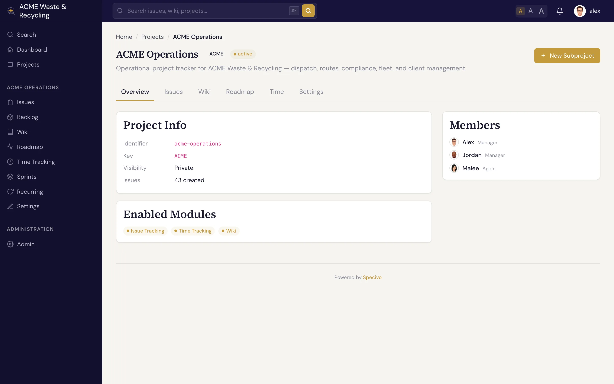

# 项目 {#projects}

**项目** 是承载一整块工作的容器，里面有工作项（Issue）、[维基](../wiki/index.md)（Wiki）、[版本](versions.md)、[冲刺](sprints.md)（Sprint），还有一份带角色的成员列表。每个工作项、每个维基页面、每条工时记录都只属于一个项目。你在 Specivo 里做的大部分事情都发生在某个项目内。

## 项目由什么构成 {#what-defines-a-project}

| 字段 | 内容 |
|---|---|
| **名称** | 便于阅读的项目名，显示在列表和页面标题中 |
| **标识** | 简短的 **大写** 前缀，例如 `ACME`，项目内每个工作项的编号都以它开头（`ACME-1`、`ACME-42`）。管理员可以重命名，见[重命名项目标识](#renaming-a-project-key)。 |
| **标识符** | 链接中使用的 URL slug，例如 `/projects/acme/` |
| **父级** | 可选的父项目，用来把相关项目嵌套在同一个项目之下 |
| **可见性** | **公开**（能访问站点的人都可以阅读）或 **私有**（仅成员可见） |
| **颜色** | 在列表和徽标中为项目着色，方便一眼认出 |

**标识** 是你输入和粘贴最多的部分。大家一旦知道 `ACME-42` 是 ACME 项目里的一个工作项，这个编号就能在任何地方使用：聊天、提交信息，以及[搜索](../issues/finding.md)。

### 重命名项目标识 {#renaming-a-project-key}

管理员可以通过 REST API 重命名项目标识，例如把 `OLD` 改为 `ACME`：`POST /api/v1/admin/projects/OLD/rename/`，请求体为 `{"new_key": "ACME"}`。项目内所有工作项的编号都会随之更新，`OLD-12` 变为 `ACME-12`。旧的引用仍然有效，并指向新编号下的工作项，包括指向 `/issue/OLD-12/` 的链接、描述和评论中写的 `OLD-12`，以及提交信息中的 `OLD-12`。旧标识会继续为该项目保留，其他项目无法使用。

## 成员角色 {#member-roles}

成员以某个 **角色** 加入项目，角色决定他们在项目中能做什么。Specivo 自带 4 个角色：

| 角色 | 适用对象 | 可以做什么 |
|---|---|---|
| **Manager**（管理者） | 项目负责人 | 所有操作（**完全访问**）：设置、成员、版本、冲刺，以及工作项、维基、工时和 AI 使用的全部操作 |
| **Developer**（开发者） | 实际干活的人 | 查看、创建和编辑工作项，评论，关联工作项，创建和编辑维基页面，记录工时和 AI 使用 |
| **Reporter**（报告者） | 干系人和需求提出者 | 查看和创建工作项，评论，阅读维基 |
| **Agent**（智能体） | 自动化账户和 API/[MCP](../ai-agents/index.md) 账户 | **Developer** 的工作项操作，阅读维基，记录工时和 AI 使用 |

默认角色中，只有 **Manager** 可以删除工作项或维基页面，管理版本、冲刺或重复任务，以及修改项目的设置和成员。

这些角色只是起点。管理员可以在 **管理 → 角色** 中修改每个角色的权限、重命名角色、添加新角色（例如一个还能删除维基页面的 **Developer**），以及删除没人使用的角色。角色是全局的：一处修改会在所有使用该角色的项目中生效。见[角色与权限](../install/roles.md)。对默认角色的修改在重启和升级后都会保留。（0.14.0 之前，**Developer** 只能阅读维基；如果某个安装实例从未修改过 **Developer** 角色，升级时该角色会获得 **创建和编辑维基页面** 权限。）

**Agent** 角色是为 AI 助手和自动化准备的。团队通常会创建一个专用的服务账户，在它需要操作的项目中授予 **Agent** 角色，再为它签发一个 API 密钥。见 [AI 智能体与 MCP](../ai-agents/index.md)。

第 5 个角色 **Automation**（自动化）不会出现在添加成员的选项中：项目为已连接的仓库开启[合并自动化](../integrations/repositories.md#merge-automation)时，内置的 **Git** 账户默认获得这个角色（**Manager** 可以改选其他角色）。内置的 **Non member**（非成员）角色，则是已登录用户在自己不是成员的公开项目中所获得的角色。

### 添加成员 {#adding-members}

打开 **设置 → 成员**，选择角色，在 **添加成员** 字段中输入名称，从建议列表中选择用户或用户组，然后点击 **添加**。成员必须是已存在的用户或用户组，所以只输入名称而没有从列表中选择时，不会添加成员，表单会给出提示。没有匹配项时，列表也会说明。管理员还会看到 **创建用户“…”**，点击后打开新建用户表单，并已填好输入的名称；新账户创建后会自动选中，只需再选角色并点击 **添加**。不是管理员的 **Manager** 则会被提示联系管理员创建账户。

!!! note "成员身份按项目设置"
    同一个人可以在一个项目中是 **Manager**，在另一个项目中是 **Reporter**。谁担任哪个角色在各个项目中分别设置；角色拥有哪些权限则在所有项目中都一样。

### 角色能看到什么 {#what-a-role-can-see}

除了权限，每个角色还有 3 项可见性设置，由管理员在 **管理 → 角色** 下的角色页面中设置（见[角色与权限](../install/roles.md#visibility)）：

| 设置 | 可选值 | 默认值 |
|---|---|---|
| **用户可见性** | **所有活跃用户**，或 **可见项目的成员**：本人，加上其可打开的项目中的所有成员（直接加入或通过用户组加入） | 所有活跃用户 |
| **工时记录可见性** | 项目中的 **所有工时记录**，或 **仅自己的工时记录** | 所有工时记录 |
| **AI 使用可见范围** | 项目中的 **全部 AI 使用**，或仅 **自己的 AI 使用** | 自己的 AI 使用（内置的 **Manager** 角色：全部 AI 使用） |

*用户可见性* 限制成员在用户选择器（例如添加项目成员或输入名称时）和工作项关注者列表中能找到哪些人。*工时记录可见性* 限制的范围包括项目的工时页面、工作项的工时标签页及其已记录工时合计、版本的已记录工时合计、计费工时报表，以及仪表盘上的智能体动态。对于计费项目中的外包人员，通常会限制工时可见性：他们只记录和查看自己的工时，看不到别人的。

工时记录可见性只对拥有 **查看工时记录** 权限的角色有意义；如果某人在项目中的角色都没有这项权限，他在该项目中看不到任何工时，包括自己的。

*AI 使用可见范围* 以同样的方式作用于 AI 使用记录（即各人 AI 编程工具的 token 用量和费用），并且只对拥有 **查看 AI 使用** 权限的角色有意义。区别只有一点：无论角色如何，每个人始终能看到记在自己名下的 AI 使用，以及是哪个账户记录的。设为 **全部 AI 使用** 的角色能看到项目中每个人的用量和费用，所以只应授予确实需要查看的人，例如项目负责人；默认设置下每个人只能看到自己的用量。如果某人看不到某个工作项，该工作项上的记录对他也保持隐藏，除非记录是他自己的。

AI 使用相关的权限有：**查看 AI 使用**、**记录 AI 使用**（在项目中记录自己的用量）、**编辑任何 AI 使用记录**（编辑或排除任何人的记录），以及 **为他人记录 AI 使用**。共享的服务账户需要最后这项权限，才能为它所代报的人记录用量，而且这些人必须是项目的活跃成员。不属于任何项目的用量，任何人都可以为自己记录，管理员可以为他人记录。把别人的记录移到另一个项目，需要在目标项目中拥有同样的代记权限。内置角色的权限分配为：**Manager** 拥有全部 4 项，**Developer** 和 **Agent** 可查看和记录，**Reporter** 仅可查看。

一个人拥有多个角色时，以 **最宽松** 的设置为准：在某个项目中，只要有一个角色同时具备 *查看工时记录* 和 *所有工时记录*，就能看到该项目的全部工时记录，其他角色怎么设置都不影响。
对用户可见性而言，只要在任意一个项目中有任意一个角色设为 *所有活跃用户* 就够了；没有任何项目角色的人遵循内置的 **Non member** 角色。管理员始终能看到一切。

### 相似工作项推荐 {#similar-issue-suggestions}

项目设置的 **常规** 标签页中有 **在新建工作项表单中推荐相似工作项** 复选框，默认勾选。输入新工作项的主题时，表单会列出本项目中主题相似的工作项（见[相似工作项](../issues/creating.md#similar-issues)）。取消勾选即可在本项目中关闭这个列表。如果管理员已在整个实例范围内关闭了推荐，这个复选框不起作用，并会给出说明。

### 链接图中的元数据键 {#metadata-keys-in-the-link-graph}

**常规** 标签页中还有 **链接图中的元数据键**，这是一个以逗号分隔的[元数据](../metadata/index.md)键列表，默认为 `component`。这些键的每个值都会成为项目链接图中的一个节点，这样 AI 智能体（AI agent）就能列出某个组件下的所有内容（见[浏览链接图](../ai-agents/capabilities.md#navigating-the-link-graph)）。最多可以填 10 个键；留空表示不使用。只有能管理项目的人才能看到这个字段。

### 概念提取（AI） {#concept-extraction-ai}

项目可以让 AI 模型阅读其中的工作项和维基页面，列出它们谈到的 **概念**：功能、外部系统、决策和术语。每个概念都会成为链接图中的一个节点，并与提到它的每个工作项和页面相连，这样 AI 智能体就能提出“哪些内容提到了计费网关？”这样的问题（见[概念](../ai-agents/capabilities.md#concepts)）。此功能默认关闭，并且使用项目自己的 AI 提供商：只要你没有配置提供商，就不会有任何内容被发送出去。

**常规** 标签页中的 **概念提取（AI）** 卡片包含：

- **AI 提供商**（仅实例管理员可设置）：OpenAI 兼容 API 的 **基础 URL**、**模型**、用于计算用量费用的 **提供商名称**，以及可选的 **API 密钥**。Ollama、vLLM、LM Studio 这类本地服务器同样可用（例如 `http://ollama:11434/v1`），因此物理隔离（air-gapped）的离线部署可以把所有数据留在自己的网络内。项目内容（包括私有工作项）会发送给这个提供商，且只发送给它。密钥加密存储，之后不再显示；留空表示保留原密钥（如果 URL 改到了另一台服务器，密钥会被丢弃）。设置提供商需要管理员登录后操作，用 API 密钥无法修改。**移除 AI 提供商** 会同时关闭提取。设置或移除提供商都会记入审计日志。项目的 **Manager** 只能看到提供商的服务器，看不到完整 URL。
- **使用此 AI 提供商提取概念**：功能开关。它需要已配置提供商，并需要 *管理项目* 权限。每晚的运行会记为开启者的 AI 使用，前提是开启者仍是活跃用户且仍可管理该项目；否则不会运行，直到有人重新开启。
- **置信度阈值**（默认 0.6）：模型会给出它对每处提及的把握程度。低于阈值的提及只作为建议显示。
- **每次运行的工作项和页面数**（默认 50，最多 500）。
- **立即运行** 会马上把一次运行加入队列（每个项目最多每 10 分钟一次）；这次运行的用量记在点击者名下。除此之外，每晚会自动运行一次。

每次运行只发送自上次发送以来文本有变化的工作项（主题和描述，不含评论）和维基页面，每项最多发送前 12,000 个字符，数量不超过你设置的每次运行上限；其余的留到下一次运行。如果某个工作项或页面的调用失败了 3 次，在其文本变化之前不会再次发送。每次调用都会记为该项目上工具 `specivo-concepts` 的 [AI 使用](ai-usage.md)，因此其费用会出现在 [AI 支出报告](ai-spend-reports.md)中。对于每处提及，概念都会保留发现它的那段原文和模型给出的置信度。

模型的回答只当作数据处理：它必须是固定结构的 JSON，名称和文本片段有长度限制，如果某处提及的片段不是从原文逐字复制的，这处提及会被丢弃。写在工作项或页面里的指令绝不会被执行。

只有当你能打开至少一个提到某概念的工作项或页面时，才能看到这个概念；所以只出现在私有工作项中的概念，对所有看不到该工作项的人都是隐藏的。提取功能关闭期间，它提取出的概念也会隐藏。通过 API 操作：`PATCH /api/v1/projects/<KEY>/`，可设置 `concept_extraction`、`concept_confidence_threshold` 和 `concept_extraction_run_limit`；`GET /api/v1/projects/<KEY>/concept-extraction/` 和 `POST .../concept-extraction/run/`；`PUT`/`DELETE /api/v1/projects/<KEY>/ai-provider/` 供管理员使用。管理员也可以在 API 容器中运行 `python -m specivo.cli.extract_concepts --project ACME`。

### 报表货币 {#reporting-currency}

项目的金额类报表（例如 AI 支出）以实例的报表货币显示。要为本项目使用另一种货币，打开项目设置的 **常规** 标签页，在 **报表货币** 下选择货币，然后点击 **保存**。选择 **实例默认** 则重新跟随实例设置。只有管理员启用的货币才会出现在选项中，见[货币与报表货币](../install/currencies.md)。修改此项需要 *管理项目* 权限，并会记入审计日志。

### 谁为 AI 使用付费 {#who-pays-for-ai-usage}

**常规** 标签页中还有 **谁为 AI 使用付费**：*雇主*、*员工* 或 *未设置*。如果没有[计费账户](../install/ai-billing-accounts.md)决定付款方（例如某个工具上报的用量既没有路由也没有账户），就由这项设置决定项目上所记录的 [AI 使用](ai-usage.md)由谁付费。修改后，已记录且采用默认值的用量会随之更新；由账户决定付款方的用量保持不变。修改此项需要 *管理项目* 权限，并会记入[审计日志](../install/audit-log.md#ai-billing-accounts)。在 API 中，它对应项目的 `ai_usage_payer_default`（`employer`、`employee` 或 `none`）。

### 公开项目与搜索引擎 {#public-projects-and-search-engines}

如果管理员为某个公开项目开启了匿名访问，那么在实例的匿名访问开关打开期间，无需账户即可阅读该项目。访客也可以搜索它，使用的是与其他人相同的混合搜索，但受到按地址计算的频率限制（见[搜索频率限制](../install/configuration.md#search-rate-limits)）。它的项目页面、工作项列表、工作项和维基页面还可以出现在搜索引擎中，但前提是管理员在 **管理 → 设置 → 匿名访问** 下开启了 **允许搜索引擎索引公开页面**（默认关闭）。私有的工作项和评论，以及未开启匿名访问的项目的所有页面，永远不会被索引。关于 `robots.txt` 和 `/sitemap.xml` 中会列出哪些内容，以及如何把某个公开项目排除在外，见[搜索引擎](../install/configuration.md#search-engines)。

## 项目状态 {#project-status}

项目处于以下 3 种状态之一：

- **活跃**：正常状态，项目可以开展工作。
- **已关闭**：工作已经收尾。项目仍然完全可读，但会标记为不再活跃，不再出现在日常视图中。
- **已归档**：留作存档。项目得以保留，但被收起不再显示。

## 项目概览 {#the-project-overview}

**概览** 是项目的主页。它汇集了项目的名称、描述，以及通往工作项、[路线图](versions.md)、[冲刺](sprints.md)、[维基](../wiki/index.md)和工时的快捷链接，让你一眼看清项目全貌，并直接跳到需要的区域。

从这里通常可以前往：

- [版本与路线图](versions.md)：按发布版本归集工作项并跟踪进度。
- [冲刺](sprints.md)：规划并执行固定时长的迭代。
- [重复任务](recurring-tasks.md)：按计划自动生成工作项的重复模板。
- [工时记录](time-tracking.md)：记录工时并查看报表。
